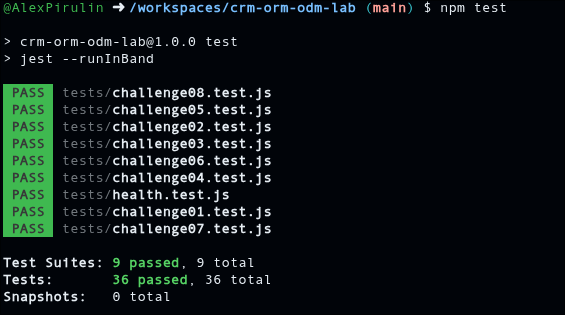

# CRM ORM/ODM Lab

API REST de un CRM básico que combina un ORM (Sequelize + PostgreSQL) y un ODM (Mongoose + MongoDB).

## Stack

- Node.js 22, Express 5, CommonJS
- Sequelize + PostgreSQL 16 (`User`, `Company`, `Contact`)
- Mongoose + MongoDB 7 (`Activity`)
- Jest + Supertest
- GitHub Codespaces, Dev Containers, Docker Compose
- Supervisor (`npm run dev`)

## Arquitectura

```text
GitHub Codespace
│
├── app       Node.js 22  ──┬── Sequelize ──> postgres (PostgreSQL)
│                           └── Mongoose  ──> mongo    (MongoDB)
├── postgres
└── mongo
```

La aplicación se conecta por nombre de servicio (`postgres`, `mongo`). Las credenciales de desarrollo llegan como variables de entorno definidas en `.devcontainer/docker-compose.yml` (ver `.env.example`).

## Iniciar el Codespace

1. En GitHub: **Code → Codespaces → Create codespace on main**.
2. Espera a que se levanten los tres servicios (`app`, `postgres`, `mongo`). `postCreateCommand` ejecuta `npm install`.

## Instalar dependencias

```bash
npm install
```

## Seed y reset

```bash
npm run seed    # inserta datos deterministas (3 users, 4 companies, 8 contacts, 10 activities)
npm run reset   # elimina y recrea tablas/base de datos y vuelve a sembrar
```

## Iniciar la API

```bash
npm start       # node ./bin/www
npm run dev     # supervisor ./bin/www
```

Servidor en el puerto `3000` (variable `PORT`).

## Pruebas

```bash
npm test
```

Cada suite restablece PostgreSQL y MongoDB antes de ejecutarse y cierra las conexiones al terminar.

## Endpoints

| Método | Ruta | Descripción |
|---|---|---|
| GET | `/health` | Health check |
| GET | `/users` | Listar usuarios |
| GET | `/users/:id` | Obtener usuario |
| POST | `/users` | Crear usuario |
| PUT | `/users/:id` | Actualizar usuario |
| DELETE | `/users/:id` | Eliminar usuario |
| GET | `/companies` | Listar compañías (`?industry=`) |
| GET | `/companies/:id` | Obtener compañía |
| POST | `/companies` | Crear compañía |
| PUT | `/companies/:id` | Actualizar compañía |
| DELETE | `/companies/:id` | Eliminar compañía |
| GET | `/contacts` | Listar contactos |
| GET | `/contacts/:id` | Obtener contacto |
| POST | `/contacts` | Crear contacto |
| PUT | `/contacts/:id` | Actualizar contacto |
| DELETE | `/contacts/:id` | Eliminar contacto |
| GET | `/activities` | Listar actividades (`?type=`) |
| GET | `/activities/:id` | Obtener actividad |
| POST | `/activities` | Crear actividad |
| PUT | `/activities/:id` | Actualizar actividad |
| DELETE | `/activities/:id` | Eliminar actividad |

Los errores se devuelven como JSON: `{ "error": "Contact not found" }`.


## Respuestas

### Sobre la arquitectura

**1. Dos motores.**
Activity es buena para una base documental porque cada actividad guarda datos distintos, y un documento puede tener la forma que necesite sin dejar campos vacíos. 
Company y Contact son buenas para una base relacional porque sus datos siempre tienen la misma estructura y están conectados (cada contacto pertenece a una compañía), y ese tipo de base mantiene esa conexión ordenada y segura.


**2. ORM vs ODM.**
Un ORM es una herramienta que nos deja trabajar con tablas de una base de datos usando objetos de JavaScript, sin escribir SQL a mano. El ODM hace lo mismo, pero con una base de documentos. En la tarea usamos Sequelize como ORM (PostgreSQL) y Mongoose como ODM (MongoDB). 
Una diferencia importante es que Sequelize trabaja con tablas de estructura fija y relaciones entre ellas, mientras que Mongoose trabaja con documentos más flexibles y no tiene relaciones reales entre colecciones.

**3. Configuración por variables de entorno.**
Escribirlas dentro de los .js es mala práctica porque el código se sube a GitHub y cualquiera podría ver las contraseñas, y porque cambiar una contraseña obligaría a modificar el código.


### Sobre Sequelize y PostgreSQL

**4. Asociaciones.**
Entre Company y Contact hay una relación de uno a muchos una compañía tiene muchos contactos y cada contacto pertenece a una sola compañía .
 La llave foránea es companyId y vive en la tabla contacts, porque es la tabla del lado "muchos". 
 El alias as: 'contacts' es el nombre con el que aparecen los contactos dentro de la compañía cuando se piden juntos , y se usa también en el include. Además, onDelete: 'CASCADE' hace que, si se borra una compañía, se borren sus contactos.


**5. Eager loading.**
Traer la compañía y luego hacer otra consulta para sus contactos significa ir dos veces a la base de datos. Con include todo llega en una sola consulta y la compañía ya trae sus contacts dentro. 
Es preferible include porque hay menos idas y vueltas a la base, es más rápido y el código queda más corto. La diferencia se nota más si se piden muchas compañías a la vez, porque con dos consultas se haría una consulta extra por cada compañía.

**6. Instancia vs consulta.**
En update de contactos primero se busca el contacto con findByPk y luego se modifica con contact.update(...). Esto permite responder 404 si el contacto no existe, aplica las validaciones del modelo y devuelve el contacto ya actualizado para enviarlo en la respuesta. 
Model.update({...}, { where }) es más rápido y sencillo porque es una sola operación, y sirve para cambiar muchos registros a la vez. Pero no devuelve el registro actualizado, solo cuántas filas cambió, así que no sabría decir si el contacto existía y tendría que consultarlo otra vez para responder.

### Sobre Mongoose y MongoDB

**7. Esquema flexible.**
Para metadata se usa mongoose.Schema.Types.Mixed, un tipo que acepta cualquier estructura por eso se puede guardar { duration, result } en una llamada, { subject, opened } en un correo y { location, attendees } en una reunión, sin cambiar el modelo. La desventaja es que se pierde el control: Mongoose no revisa qué campos hay ni de qué tipo son, y si hay algunn error de escritura se guarda sin avisar.
Definir cada campo con su tipo daría validación y datos más confiables.

**8. Sin ref.**
ref y populate solo sirven para conectar documentos de MongoDB entre sí. contactId y userId son números que apuntan a filas de PostgreSQL, otra base de datos distinta, y Mongoose no puede consultarla. 
La consecuencia es que nada vigila la coherencia entre ambas. Si se elimina un User en PostgreSQL, sus actividades siguen en MongoDB apuntando a un id que ya no existe, o sea, quedan "huérfanas". Esto tendría que resolverse desde el código, borrando las actividades al eliminar el usuario o validando que el id exista antes de crear una.

**9. Documento actualizado.**
Por defecto, findByIdAndUpdate de Mongoose devuelve el documento tal como estaba antes de la actualización, aunque el cambio sí se guarda en la base. Por eso la respuesta mostraba los datos viejos y la prueba del Reto 08, que espera ver description: 'Llamada actualizada' en la respuesta, no pasaba. Para corregirlo agregué la opción new: true, que hace que devuelva el documento ya actualizado. También dejé runValidators: true, para que se apliquen las validaciones del esquema (por ejemplo, que type sea CALL, EMAIL o MEETING) también al actualizar.

### Sobre pruebas y proceso

**10. Pruebas de comportamiento.**
Probar lo que la API responde en lugar de cómo está escrito el código por dentro es mejor porque lo importante es que la API funcione bien para quien la usa. Así puedo cambiar la implementación, por ejemplo cambiar findAll() por otra consulta o hasta cambiar de librería, y las pruebas siguen sirviendo mientras la respuesta sea la correcta. Las pruebas atadas a la implementación se romperían con cada cambio interno aunque la API siga funcionando.

**11. Repetibilidad.**
Antes de cada suite, tests/setup.js conecta a PostgreSQL y a MongoDB y llama a reset(). Esa función borra y vuelve a crear las tablas, elimina la base de MongoDB  y vuelve a insertar los mismos datos iniciales. 
Después de cada suite, cierra las dos conexiones. Es necesario porque las pruebas crean, modifican y borran datos. Si no se limpiara, los cambios de una ejecución afectarían a la siguiente (por ejemplo, la descripción ya cambiada o contactos que ya no existen) y npm test podría dar resultados distintos cada vez. Con el reset, siempre se empieza del mismo punto, y cerrar las conexiones evita que Jest se quede colgado.

**12. Tu experiencia.**
No se si podria decir que fue el reto mas dificil por dificultad del reto o porque sea algo muy especifico, pero en el reto que me trabe mas o no supe que hacer en cierto punto fue en el reto 5, pero la verdad es que fue un fallo bastante tonto. Lo que paso fue que en controllers/companies.js no estaba importado Contact, así que el include no podía encontrar el modelo. Y si me quede un rato sin saber que hacer pero ya buscandole vi que nomas era eso

## Evidencia

